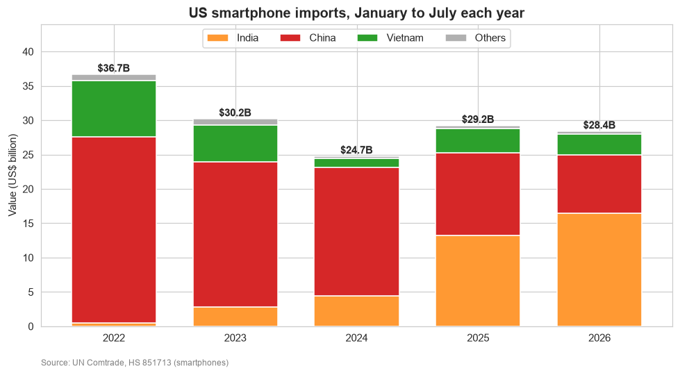
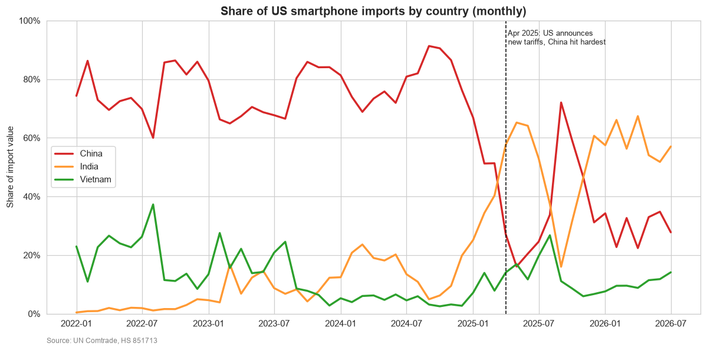
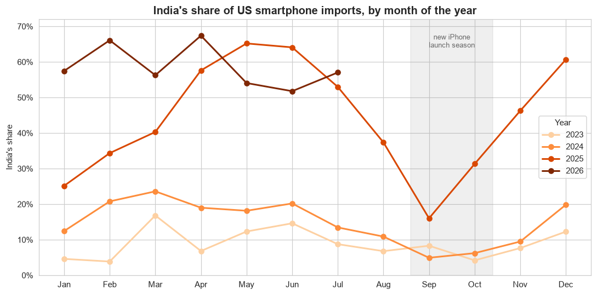
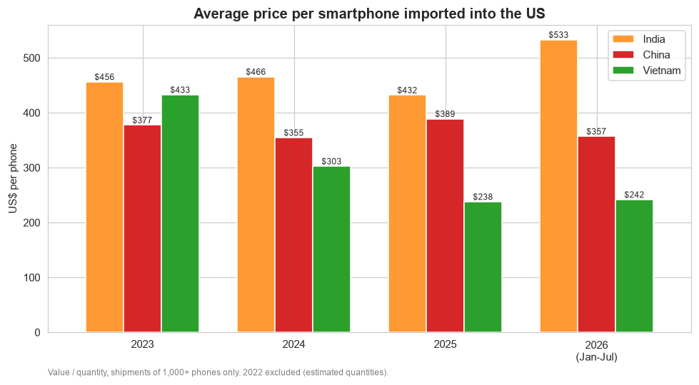
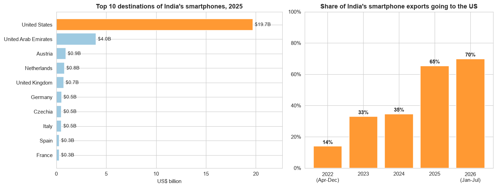
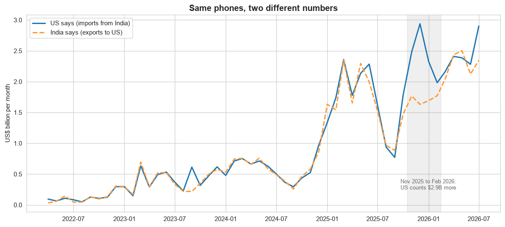

# Made in India, Sold in America: Smartphone Trade Analysis (2022 to 2026)

In 2025 the news was full of headlines about iPhones being made in India and the US putting new tariffs on China.
I wanted to check with real data: **is India actually replacing China as the phone factory for America?**

For this project I collected monthly trade data from the **UN Comtrade** database, cleaned it with Python, and analysed
US smartphone imports and India's smartphone exports from January 2022 to July 2026.

**[Open the interactive dashboard](https://niranjan6030.github.io/india-smartphone-trade-2026/)**



## Questions

1. How big is the US smartphone import market and who supplies it?
2. How did each country's share change month by month, and what happened after the 2025 tariffs?
3. Is there a seasonal pattern?
4. What kind of phones does each country make (price per phone)?
5. Where do India's smartphones go?
6. Do India's and America's numbers for the same trade match?

## Dataset

| | |
|---|---|
| Source | [UN Comtrade](https://comtradeplus.un.org/) (free preview API) |
| Product | HS code **851713**, "Smartphones" |
| Data 1 | US imports of smartphones from every country, Jan 2022 to Jul 2026 (55 months) |
| Data 2 | India's exports of smartphones to every country, Apr 2022 to Jul 2026 (52 months) |
| Raw files | 107 JSON files, 4,193 rows, 47 columns each |
| After cleaning | 4,086 rows, 13 columns |

The data starts in 2022 because the smartphone code (851713) was only created in the HS 2022 update. Before that,
smartphones were mixed with all other mobile phones.

## Tools used

- Python: pandas, matplotlib, seaborn, requests
- Jupyter Notebook
- Excel (cleaned data workbook)
- HTML, CSS, JavaScript and ECharts (interactive dashboard)

## Project structure

```
data/
  raw/us_imports/          55 monthly JSON files, as downloaded
  raw/india_exports/       52 monthly JSON files, as downloaded
  raw/partner_codes.json   country code list from Comtrade
  cleaned/                 cleaned CSV files + Excel workbook
notebooks/
  01_data_collection.ipynb downloading the data from the API
  02_data_cleaning.ipynb   cleaning and checks
  03_analysis.ipynb        analysis and charts
dashboard/
  template.html            dashboard page (layout, charts, filters)
  build_dashboard.py       puts the cleaned data into the page
docs/index.html            the finished dashboard (served by GitHub Pages)
images/                    charts used in this README
```

## Interactive dashboard

[Open it here.](https://niranjan6030.github.io/india-smartphone-trade-2026/) It has four sections: the shift from China
to India, who ships what (suppliers, price per phone, the September dip), India's side of the trade, and checks on the data.

- Filter by year, switch between all months and Jan to Jul only, and switch between import value and number of phones
- Click a supplier tile to highlight that country in every chart, or click one of India's export destinations to compare it with the US
- The headline numbers and the key takeaways are recalculated from whatever you select

## Data cleaning

The raw data had more problems than I expected. Full details are in
[`02_data_cleaning.ipynb`](notebooks/02_data_cleaning.ipynb).

| Problem | What I did |
|---|---|
| 47 columns, 14 of them completely empty and 17 with the same value in every row | Kept the 13 useful columns |
| Countries are numbers (699, 156...) not names | Mapped them with Comtrade's code list. "Other Asia, nes" is how the UN lists **Taiwan**, so I renamed it |
| A "World" total row every month mixed with the country rows (would double every sum) | Moved them to a separate table, after checking that the countries add up to the World total for all 107 months |
| The `isAggregate` column looked like the way to find World rows, but for India it is True for 1,695 rows | Found it just means "calculated by Comtrade, not reported by the country". Used `partnerCode == 0` instead |
| Some rows have 0 phones but millions of dollars (India's World total for Apr 2025: 0 phones, $2.3B) | Filled from the `altQty` column (7.1 million phones) |
| All 2022 US quantities are **estimated** by Comtrade, so every country shows exactly $283 per phone | Kept the 2022 values but removed 2022 prices |
| Tiny shipments give silly prices (1 phone from Croatia for $9,504) | Price per phone only uses shipments of 1,000+ phones (they are 61% of rows but only 0.03% of value) |
| India's Jan to Mar 2022 missing | Checked the API: India reported those months under the old HS 2017 code, which mixes all phones. India's analysis starts from Apr 2022 |

## Key findings

### 1. India grew 35x while the market shrank

For January to July, US smartphone imports fell from **$36.7B (2022) to $28.4B (2026)**. In the same period, phones from
India went from **$0.47B to $16.45B**, and China fell from $27.1B to $8.5B.

### 2. India overtook China in April 2025, the month of the new US tariffs



India was under 5% of US smartphone imports for most of 2022. It passed China for the first time in **April 2025** (58% vs
27%), the month the US announced its new tariffs with China hit hardest. Since then India has been ahead in 13 of 16
months, including every month of 2026 so far. The timing matches, but India's share was already rising from 2023, so the
tariffs are not the only reason.

### 3. India's share drops every September



Every year India's share falls around September/October and recovers by December. The low points were 4% (Oct 2023),
5% (Sep 2024) and 16% (Sep 2025). New iPhones launch every September, so my guess is that the first batches of new
models still come mostly from China. The low point is rising every year, so India seems to be making more of the
launch-season phones each year.

### 4. India ships the most expensive phones



Phones from India average **$533** in 2026, compared with $357 from China and $242 from Vietnam. That fits with news
reports that most of India's smartphone exports to the US are iPhones (Vietnam mostly makes Samsung phones).

### 5. 70% of India's smartphone exports now go to one country



India's smartphone exports grew from $14.3B (2023) to **$30.1B (2025)**. The US share went from 14% in 2022 to **70%**
in 2026. That's a big success, but also a risk: most of this industry now depends on US trade policy.

### 6. The two countries' numbers don't always match



The same phones are counted twice: by India when they leave and by the US when they arrive. Until October 2025 the two
numbers were within about 3% (normal, because the US value includes shipping and insurance). But from **November 2025
to February 2026 the US counted $2.9B more** than India reported. I couldn't find the exact reason. The notebook lists
the possible ones (country of origin vs destination, timing, later revisions).

## Limitations

- Trade data doesn't show brands or models. "These are iPhones" comes from the price and news reports, not from this data.
- Comtrade can revise recent months, so the 2026 numbers may change.
- The analysis shows timing, not cause. I can't prove the tariffs caused the shift.

## What I learned

- Reading the documentation matters. `isAggregate` sounded like "total row" but meant something else, and using it
  would have deleted most of India's data.
- Always check if numbers are real or estimated. The $283 price for every country in 2022 looked fine until I compared
  countries side by side.
- Validating totals (countries vs World row) gave me confidence the cleaning didn't lose anything.
- Working with an API: looping over months, saving raw files, and handling rate limits.

## Future scope

- Rebuild the dashboard in Tableau Public or Power BI
- Add China's and Vietnam's own export data to compare all three sides
- Update every month as new data comes out
- Look at other electronics (laptops, tablets) to see if the same shift is happening

## How to run

```bash
pip install -r requirements.txt
jupyter notebook
```

Run the notebooks in order: `01` downloads the data (a few minutes, skips files already saved), `02` cleans it,
`03` makes the charts. Then rebuild the dashboard from the cleaned data:

```bash
python dashboard/build_dashboard.py
```

---

**Niranjan S**, BCA, Christ University, Bengaluru
[LinkedIn](https://www.linkedin.com/in/niranjan-s-8b9283306)
